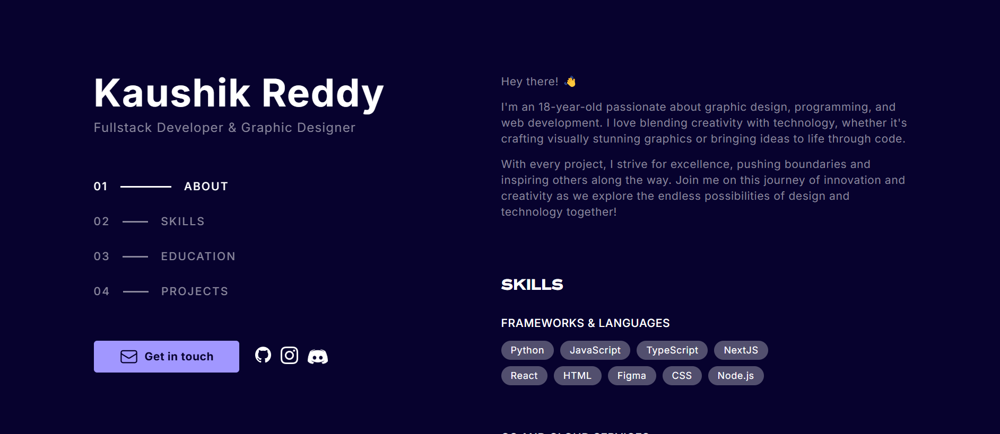
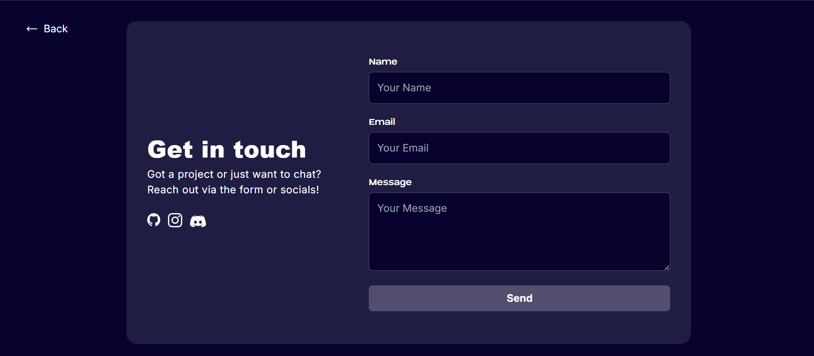

<h1 align="center">
  Minimalistic Portfolio
</h1>

  
  
  
  
  
  

  
  

<h5 align="center">
  <a href="https://kaushikreddy.me/">
    <strong>Live Portfolio •</strong>
  </a>
  <a href="https://github.com/Juzcallmekaushik/kaushikreddy.me/discussions/">
    <strong>Request a feature •</strong>
  </a>
  <a href="https://github.com/Juzcallmekaushik/kaushikreddy.me/issues">
    <strong>Report a bug</strong>
  </a>
</h5>

  
  

<h3>
Features:
</h3>

1. Contact Form: Easily connect with visitors.
 
2. Mobile Ready: Responsive across all devices.
 
3. Projects: Showcase work and achievements.
 
4. Skills with Links: Highlight expertise with resources.
 
5. Copyright: Dynamic footer copyright notice.
 
6. Smooth Animations: Engaging transitions and effects.
 
7. Customizable Design: Flexible, theme-based design system.
 
8. Social Media Links: Connect with online profiles.

